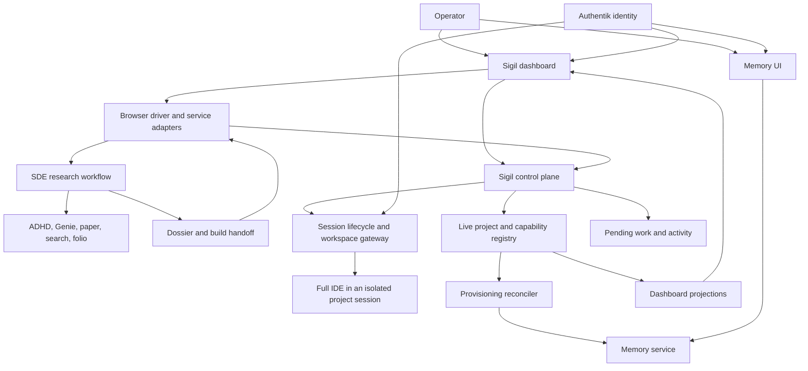

# SIGIL OS — implementation blueprint

Date: 2026-09-10  
Status: approved for unattended implementation; design and plan committed to the Sigil implementation branch; no runtime changes deployed  
Confirmed requirement: a full browser IDE with terminal and Git tools

## The product

Open `https://sigil.016180.xyz/` and understand what is happening across the system, what needs your attention, and where to act. Open any project and enter its full development environment. Open `https://memory.016180.xyz/` and inspect, search, add, and curate remembered information with its sources visible.

A newly registered project receives these capabilities through the platform. It does not require a custom dashboard card, a new frontend build, or hand-written integration with each service.

The defining experience is: **create a project → see it in Sigil → research with SDE when needed → inspect its decisions → open the project's IDE → do work → find the resulting knowledge in memory**. Every step reports its actual state, including failures and incomplete provisioning. Direct development remains available without starting a research run.

## What was verified

Inspection used the live Sigil API, the deployed driving contract 2.3.0, an elevated workspace on `sigiled`, and read-only workspaces on `memory`, `adhd`, `genie`, and `sde`. Each workspace's recent Git handoff was read before inspection. No inference calls, model load/unload operations, or research runs were started for this audit.

| Finding | Evidence | Consequence |
|---|---|---|
| Sigil already registers projects, runs sessions/jobs/apps, records history, and tracks merge debt. | Live `/sigiled/projects`, `/services`, project logs; `sigiledd/src/main.rs` and `events.rs`. | Retain the orchestrator and its lifecycle. |
| The registry reported no merge debt during inspection. | Live `/sigiled/projects`. | No merge-debt recovery was required before this design work. |
| Services are compiled into the control plane. | `catalog.rs` uses `include_str!("../../catalog.json")`. | Project-provided services need dynamic registration. |
| Runtime workspace names and URLs use only the project. `open` calls `create_container`, which first destroys the container with that name. Close/recycle also derive the name from the project. | `runtime.rs` at `vm_name`, `endpoint`, `create_container`; `sessions.rs` at `open`, `close`, `recycle`. | Fix session isolation before introducing concurrent human and agent workspaces. This is a source-level finding; no destructive collision test was run on production. |
| The contract documents `GET /sessions/{id}`, but the inspected router does not register it. | `docs/sigiled-contract.md` versus `sigiledd/src/main.rs`. | Implement and test a truthful session inspection API; do not build the dashboard against assumed endpoints. |
| Memory has index listing, hybrid search, ingestion/history, manual insertion, provenance-based deletion, and export. | Live memory search/index/health calls; `memory/src/api.rs` and `main.rs`. | Reuse the existing Rust service and search engine. |
| Memory has no root UI, paginated chunk browsing, or single-record revision API in the inspected router. | `memory/src/main.rs` and `api.rs`. | Add the missing browser and curation APIs. |
| Reindexing refreshes sources already recorded in index metadata. | `jobs/reindex.sh`. | New-project memory enrollment needs a reconciler. |
| Neither `sigiled` nor `memory` had its own memory index at inspection. Shared recall worked through `mem0`. | Searches returned typed missing-index responses; documented fallback to `mem0` succeeded. | A registry entry must not be presented as an already provisioned memory index. |
| An earlier agent-OS note exists, explicitly unratified. | `docs/plans/2026-08-09-sigiled-as-agent-os.md`. | Preserve its useful kernel/runtime/services distinction without treating candidate ideas as approved requirements. |
| Atomic services already share a ratified mesh contract. | Genie's `docs/mesh-contract.md`, heading v0.3; adopted contracts in ADHD and SDE. | Reuse request tracing, error envelopes, asynchronous operations, model-slot names, and lifecycle ownership. |
| ADHD is an ideation engine with typed results, per-run progress, warnings, and usage. Its router has no run-list endpoint, and only terminal records are spilled. | `adhd-svc/src/{runs,store,lib}.rs`; live OpenAPI. | Add a discovery adapter/list API for a dashboard; do not describe unfinished ADHD runs as restart-resumable. |
| Genie owns inference routing, local-model locking, and a usage ledger. | `genie/src/{routes,ledger}.rs`; live `/info` and `/status`. | Reuse Genie for all model execution and metering; retain explicit local-model acquisition. |
| SDE already composes research through Genie, paper, search, folio, and ADHD. | Live `/catalog` reports these dependencies ready with no blocked stages. | Keep the research workflow in SDE. The dependency report is catalog readiness, not a fresh end-to-end inference test. |
| SDE supports caller-delegated stages, persisted stage transitions, failed-stage resume, dossier output, and a build handoff. | Live OpenAPI; `sde-core/src/run.rs`, `sde-svc/src/{runs,store,pipeline}.rs`, `docs/handoff.md`. | Surface the existing state machine and handoff in the project UI. |
| SDE has no memory dependency in its inspected stage pipeline or live dependency catalog. Its run record also has no canonical project field. | SDE run/pipeline source and live `/catalog`. | Add project/run association and an explicit accepted-artifact memory bridge at the browser-driver/integration layer. |

The registered branch heads at inspection were `f05cbbe6f4f69829f778c11405182732b3794d40` for Sigil and `882ecb0a2613b0846f7e3200ea6e49a403bb6a64` for memory. The live health endpoint reported `2.0.0-alpha.1`; the version alone does not prove its build SHA. Deployed configuration still needs verification before rollout. A direct request to the proposed `sigil.016180.xyz` hostname failed during TLS negotiation from this inspection environment; its edge/DNS/TLS setup is a rollout prerequisite.

App records expose useful revision differences:

| Project | Inspected repository head | App-record deployed revision | Meaning |
|---|---|---|---|
| memory | `882ecb0a2613` | `882ecb0a2613` | Aligned at the inspected revision. |
| adhd | `e2c86ce0a09b` | `657b9a4309a8` | The running image predates the latest shortlist/trap-disjointness fix. No upgrade was performed. |
| genie | `347b0a95767f` | `725f24876479` | Head adds schema-preservation regression tests and documentation; the latest commit describes no behavior change. |
| sde | `d06bfaaff8ff` | `e4bf8e730d05` | Later inspected commits are research dossier records; a revision difference is not automatically a missing runtime feature. |

These are control-plane app records, corroborated by live service reads, not independently verified container image digests. Health, repository revision, deployed revision, and feature readiness must remain separate fields.

## How the existing services shape the design

| Component | Responsibility retained | Browser integration |
|---|---|---|
| Sigil | Project identity, runtime lifecycle, Git coordination, jobs/apps, approvals. | Home, project workspace, status, activity, attention, and capability registration. |
| SDE | Research composition, evidence, alternatives, stage decisions, dossier, resume. | Research run list, stage timeline, decision prompts, dossier review, and build handoff. |
| ADHD | Divergent ideation, criticism, shortlists, warnings. | Optional idea-run detail panel; SDE remains its existing research caller. |
| Genie | Provider/size resolution, inference, exclusive local-model state, usage. | Models/status view and usage drill-down. A configured slot is not proof that a provider will accept that model name. |
| memory | Retrieval, provenance, indexes, ingestion. | Recall and curation UI; approved outputs link back to their project/run/source revision. |

This is a browser operating environment over an existing service mesh. SDE's domain orchestration remains in SDE. New cross-surface actions are performed by an explicit **browser driver** representing the signed-in operator, the same role that currently starts runs and opens target-project sessions.

### Preserve the ratified composition boundary

SDE's `docs/composed-service-auth.md` records the implemented Setup 1 decision: an originator supplies a short-lived JWT; composed services forward that same JWT and hold no caller credentials of their own. Genie separately holds its external provider keys as required for inference. Browser integration must respect this distinction.

The browser driver obtains a compatible operator token from Authentik and holds it server-side behind a browser session. It forwards that token to SDE, which forwards it to ADHD/Genie and its other dependencies. Cookie-only reverse-proxy sign-in is insufficient for this chain: SDE and ADHD require an inbound bearer to forward. Do not introduce per-service credential minting or silent static-token substitution. An expired in-flight SDE token produces a visible failed stage; resume supplies a fresh token and preserves completed work. Browser authentication and its accepted token claims need a live compatibility test before rollout.

New service interfaces adopt the existing mesh's `X-Request-Id`, error envelope, asynchronous operation shape, self-description, and provider/size naming. Existing memory and Sigil endpoints keep their contracts through adapters. OpenAPI describes API shape; a small versioned capability descriptor additionally declares safe UI entry points, health/status paths, supported actions, and operation discovery. Do not assume every service supports `/healthz`, SSE, cancellation, or the same error format today.

### SDE is the reference research module

Project pages gain a Research view using SDE's existing `/runs`, run detail, stage submission, `/resume`, `/dossier`, and `/handoff` APIs. The view preserves `pending`, `running`, `awaiting_caller`, `failed`, and `done`, plus per-stage skipped/failed details and computation provenance. A completed run with no decision is distinct from an accepted design ready to build.

`awaiting_caller` becomes an actionable dashboard item with the stage, required input, deadline, and exact submission rules. Categorize, pick, and converge are model tasks delegated to a caller; they are not automatically human approval prompts. A browser-launched run must explicitly choose an attached agent or engine computation. With no attached agent, pass an explicit empty delegation list; do not accidentally park the run until its current timeout fallback fires. Attended mode keeps the configured delegation, deadline, and fallback visible. Claims about the model that computed a stage come from SDE's `computed_by` field.

The browser driver associates a project with the SDE run and request trace. Add optional project/origin metadata and idempotency support to run creation so retrying after a network timeout cannot create a second paid run. Preserve legacy runs as unassigned unless the operator links them; do not infer their project from problem text. Service-specific IDs remain intact within a common operation reference, rather than copying all service state into a second scheduler.

“Build in project” follows SDE's existing driver-side protocol: obtain the handoff bundle, open the selected project session, honor merge debt, read the Git handoff, commit the dossier and cover sheet, then open that session's IDE. SDE continues to emit the package; it does not acquire credentials or become a workspace orchestrator. Honor current stage-submission behavior over older prose: later SDE code supports submitting convergence for a finished run lacking a decision.

Once accepted artifacts reach the target project's default branch, the memory adapter ingests the committed dossier/handoff through that project's allowed documentation sources. Indexing retries are idempotent and carry the run ID and commit revision. Unaccepted research can be inspected in SDE without being silently promoted to shared memory. Project context recalled for a new run remains visibly separate from cited research evidence.

### Operational gaps to carry into implementation

- SDE resolves its service catalog at startup. A dynamic registry requires bounded refresh and revision reporting; each new run records its dependency snapshot. Do not silently redirect an in-progress run when registration changes.
- SDE persists transitions, but its store logs and swallows disk-write failures. Add a visible persistence-health state before the UI claims a run can survive restart. ADHD's terminal-result spill has a similar limitation.
- ADHD lacks run-list discovery and durable in-progress recovery; Genie usage rows carry a request ID but no project ID. Use adapter metadata and additive APIs to expose them honestly.
- Genie external completions currently reject `stream:true`; ADHD's live event buffer does not survive restart; SDE currently exposes polling rather than an SSE run endpoint. The UI must advertise the capabilities actually present.
- Genie ledger writes are best-effort. Usage displays are observed usage, with missing values distinguished from zero. Do not sum SDE totals, ADHD totals, and Genie's underlying calls as separate consumption.
- Runtime drift deserves attention with its actual change type. In particular, surface ADHD's undeployed behavior fix without automatically upgrading it during this investigation.

## Recommended approach and alternatives

**Recommended: extend Sigil with a shared browser shell and modular services.** Sigil continues to own project identity, workspaces, lifecycle, and authorization. The dashboard consumes aggregate state; the IDE runs inside its own project session; memory remains independently deployable. This fits the current system and gives automatic integration a single source of truth.

**Alternative: install a separate development portal as the main platform.** This could provide ready-made workspace screens but would introduce a second project/workspace registry and require reconciling competing lifecycle rules. It is a larger migration than this request needs.

**Alternative: build three independent interfaces.** This delivers individual screens sooner, but duplicates project discovery, authorization, navigation, and error handling. It would leave the ecosystem integration problem unresolved.

For the full IDE, use **code-server** as the proposed first provider. Its maintained documentation covers browser access, reverse proxies, external authentication, and WebSockets. OpenVSCode Server is a viable alternative behind the same provider interface. The project lifecycle must not depend on the editor brand. [code-server guide](https://coder.com/docs/code-server/guide), [OpenVSCode Server](https://github.com/gitpod-io/openvscode-server).

## Architecture

### Project identity and automatic integration

Keep the existing project slug as the canonical identifier. Extend project metadata with a display name, description, repository reference, manifest revision, declared capabilities, and observed provisioning state. Existing manifests remain valid through additive defaults.

Every project inherits dashboard visibility, workspace/IDE availability, activity history, pending-work integration, and a project-scoped memory namespace. Heavy processes start on demand; inheritance does not mean running an idle IDE container for every project.

Optional manifest sections configure IDE preferences, memory sources/sharing, and service discovery metadata. The existing `[app]`, `[jobs]`, `[workspace]`, and `[compose]` meanings remain intact. The new IDE settings belong in a separate optional table so they do not invalidate the current `[workspace] dockerfile` requirement.

A reconciler compares declared state with observed state on project creation, manifest changes reaching master, service restart, and periodic repair. Operations are idempotent and persist their stage, revision, and last error. A memory outage leaves a usable project with “Memory setup pending,” then retries; it must not require creating the project again.

The runtime registry supplies all dashboard rows. For project-provided services, extend the service-catalog response from validated manifest declarations. Keep built-in service entries as a bootstrap seed. Reserved names cannot be overridden, and conflicting declarations produce a visible validation failure. Routes resolve only registered services and allowed internal targets; project metadata cannot turn the gateway into an arbitrary URL proxy.

Creating a project must not trigger a control-plane rebuild. Periodic reconciliation repairs missed notifications, so an in-memory event bus is not a durability dependency. An existing project with a missing repository remains visible with an actionable repository error.

### Browser identity and access

Use the existing Authentik identity system. Add browser login with an authorization-code flow, PKCE, state/nonce validation, server-held compatible operator JWTs, and secure host-only session cookies. The browser driver is the originator described above. Browser requests act as the actual human; they must not impersonate `sigiled-claude` or receive a shared stack credential.

Dashboard and memory use the same browser-session contract and consistent sign-in/navigation. Their origins retain separate host-only cookies, while the IdP provides single sign-on. Mutation handlers check authorization, CSRF tokens, and the request origin. Machine API authentication remains compatible.

Workspace gateway access binds a human identity to a specific project, session, and lifecycle generation. Raw workspace credentials stay server-side. Closing, recycling, or revoking a session invalidates both HTTP access and existing IDE WebSocket connections. Workspace/preview content must not share the dashboard's origin.

### Session isolation — required foundation

Allocate a unique runtime name and route to every session. Persist the exact runtime identity, actor, project, branch, lifecycle state, endpoint generation, image digest, and IDE state in the session record. Close, recycle, reaping, health checks, and log inspection all use that record; none reconstruct a container target from the project alone.

New API session routes include the session identifier. Existing project-based routes are supported during migration only when there is one unambiguous eligible session; otherwise they return a migration error. They must never silently choose another session or destroy a running workspace.

Human IDE sessions use their own branch by default. Existing agent sessions remain inspectable through status, changes, and history. Simultaneous editing of one checkout is outside the first release; the existing merge-at-close mechanism coordinates separate branches.

Serialize project-mirror preparation and branch allocation where necessary, while keeping workspace execution independent. Test simultaneous opens, closes, recycle, and recovery after restart. Compatibility metadata lets old sessions drain safely before the old naming scheme is retired.

### Full project IDE

“Open IDE” creates or resumes the operator's workspace and opens `/workspace` with its project's toolchain. The interface provides files, search, terminal, Git diffs, extensions, and access to project development servers. The project page shows the branch, active actors, saved state, committed state, pushed state, and merge result distinctly.

Package a pinned IDE bundle as a platform-managed layer over the resolved project image, cached by base-image digest and IDE version. Preserve the project's entrypoint and toolchain. Start the IDE as a supervised process after repository bootstrap. New projects inherit this capability; existing projects receive compatibility checks and an explicit migration result. An incompatible image is shown as “IDE setup required,” never reported as ready.

Serve workspace content on session-specific origins, proposed as `<session>.ide.016180.xyz`, behind the authenticated workspace gateway. Provision wildcard DNS/TLS once. Development previews use separate authenticated origins with an explicit session/port mapping. IDE ports are not published directly to the internet. The gateway uses a registry lookup and validates ownership for every route and WebSocket upgrade.

Retain Sigil's durability rules. The IDE's commit action routes through a Sigil command that commits and pushes; terminal/Git-extension commits must also be detected and pushed by a supervised branch-sync process. Show a failed push as unprotected work and preserve the workspace for retry. Restrict synchronization to the session branch. Protect master against direct IDE pushes through enforced repository policy before enabling full write access.

Autosave protects editor buffers when written to disk; recovery checkpoints protect dirty work on the session branch. Unsaved browser buffers are not claimed to be durable. Closing the browser disconnects the UI rather than merging the branch. A deliberate “Finish session” action commits pending work, updates the operational log, pushes, then uses the normal close/merge path. Reaping checkpoints and preserves the branch without merging. Flush or push failure must prevent destructive cleanup.

Define real IDE activity separately from background polling so active editing or terminal work keeps a session alive without a forgotten tab keeping it alive forever. Persist editor settings/extensions in a declared operator profile volume; keep project files in the project workspace/Git lifecycle.

### System dashboard

At `sigil.016180.xyz`, lead with **Needs attention**, followed by active work and the complete project list. Provide search, status filters, last activity, current actors, app health, latest job outcomes, pending items, merge debt, image/template drift, and memory ingestion state.

Each project has Overview, Workspace, Research, Jobs, App, Memory, Activity, and Pending views. Modules use a shared navigation and presentation contract. Show “Unavailable,” “Stale,” and “Not configured” explicitly instead of inventing healthy states. Include repository and deployed revisions, source-of-status, and observation time. Project model/usage panels consume Genie through the same adapter mechanism.

Add aggregate overview and project-detail endpoints backed by the registry, session records, manifest definitions, app/job state, and bounded service probes. Dashboard reads must never open workspaces. Paginate activity; cache expensive probes with timestamps; use bounded polling initially and incremental events when available.

“Pending” combines two clearly identified sources:

- **System attention:** SDE caller-delegated stages, interrupted research requiring resume, completed dossiers awaiting handoff, merge conflicts, failed jobs/builds, incomplete provisioning, failed pushes, stale ingestion, or access problems. These resolve when the underlying condition is repaired. The source service owns its run state.
- **Explicit work items:** human/agent-created open questions, next actions, and blockers. Persist a small record with project, title, state, owner, source link, timestamps, and revision. Support open, blocked, and done. Changes are audited and reject stale revisions. Do not infer these items from arbitrary prose or silently mark them complete.

### Memory interface

At `memory.016180.xyz`, provide index browsing, global or project-scoped search, filters by source/tags/date, and a detail view showing the full memory, provenance, timestamp, and related source. Show ingestion status, history, errors, and actions to add material or retry ingestion.

Add paginated chunk listing/detail and stable manual-memory records. Manual memories support creation, editing with revision checks, tagging, pinning, archive/restore, and scoped deletion with an affected-record preview. Keep revisions and the actor behind each change. Do not implement “edit” by bulk-deleting every record with the same provenance and reinserting one chunk.

Source-derived memories retain their source identity. “Edit source” opens the file in its project IDE; a correction can be stored as a separate, linked annotation. Pins and annotations survive reindexing. Forgetting imported content records a suppression rule or changes the source enrollment, otherwise the next ingestion would resurrect it. Explain whether the user is hiding a memory, removing a source, or deleting original content; the UI does not delete source files implicitly.

Existing `/search`, `/idx`, ingest, and export clients continue working. Do not use full-index export as the UI pagination mechanism. Imported content is rendered safely as data, not executable HTML.

New projects receive a dedicated namespace automatically. Default source policy indexes approved project documentation and the operational log in that namespace; source-code indexing is opt-in. Sharing project material into `mem0` is explicit. Existing sources and sharing choices are preserved. Pinning is a curation signal separate from search relevance/recency; it does not invent a numeric “importance” score.

## Delivery sequence

| Stage | Deliverable | Acceptance gate |
|---|---|---|
| A. Foundation | Session isolation, inspectable lifecycle records, additive registry/manifest contracts, idempotent provisioning state, browser identity contract. | Two same-project sessions cannot interrupt one another; legacy session migration works; old clients and manifests remain valid. |
| B. Dashboard and service adapters | Live overview, project pages, attention queue, SDE research inspection, Genie status, activity, explicit work items, shared navigation. | Registering a project makes it appear without a frontend change or a control-plane rebuild; reads never create sessions or start inference. SDE waiting/failed/no-decision states render correctly. |
| C. Full IDE | Inherited IDE image layer, authenticated session routing, toolchain/terminal/Git integration, checkpoint/push/close behavior. | A human edits, runs tools, commits, reconnects, and finishes while an agent works independently in the same project. Both branches survive and merge correctly. |
| D. Memory UI and research handoff | Browse/search/detail, ingestion controls, manual curation, source links, enrollment reconciliation, accepted-dossier indexing. | A new project receives a namespace; an SDE handoff opens the intended IDE session and its committed result becomes recallable; corrections/deletions behave correctly after reindexing and restart. |
| E. Integrated rollout | DNS/TLS/SSO, compatibility migration, recovery procedures, end-to-end verification. | The complete create → dashboard → IDE → commit/close → memory flow succeeds in the deployed system. |

Each stage is independently reviewable. Completion of one is not completion of the full request.

## First implementation scope: foundation

Work primarily in `sigiled`: `sigiledd/src/sessions.rs`, `runtime.rs`, `reaper.rs`, `store.rs`, `main.rs`, `project.rs`, `manifest.rs`, `catalog.rs`, and focused new modules for projections/reconciliation. Extend edge examples, lifecycle documentation, and the driving contract together. Check actual deployed routing before switching any live endpoint.

The session migration adds persisted runtime identity/lifecycle fields with backward-compatible deserialization. Records loaded from the old format are treated as legacy and reconcile against observed containers before operations proceed. New session IDs use a cryptographically secure random generator and an atomic uniqueness check. Failed provisioning tears down only its own newly allocated resources. Restart recovery reconciles creating, active, closing, and failed states without assuming an in-memory task survived.

The foundation API supplies redacted session list/detail responses and aggregate project state. Tokens and environment values never appear in them. Access checks validate the requesting actor and target session. Durable provisioning records track desired revision and actual stage; successful stages are not repeated after restart.

Meaningful verification includes concurrent same-project opens; cross-session token rejection; close/recycle/reaper targeting; failed push/flush preservation; process restart with in-flight provisioning; missing repository; service-name collision; old snapshot loading; malformed manifests; and regression tests for existing create/open/close/job/app behavior. A fake container runtime should cover collision and failure cases without risking production workspaces.

## Rollout and recovery

Prepare and test changes through normal project sessions and commit/close them with operational-log entries. Closing a code session updates master; it does not by itself deploy the new control plane. Use the documented external supervisor for control-plane deployment after the concrete release is ready for operator approval.

Stage browser routes and canary capabilities behind feature flags. Back up control-plane state and memory metadata/data before migrations. Apply additive schema changes first. Deploy the runtime/gateway migration, then the dashboard, IDE, and memory interfaces. Verify human login, machine callers, WebSockets, service registration, and the end-to-end acceptance flow before enabling defaults for all projects.

Rollback disables the new UI/IDE entry points while preserving branches, memory data, and provisioning records. A binary rollback is allowed only while its state reader is compatible; otherwise retain the newer schema reader with the new features disabled. Restore backups only as an explicit recovery operation, not as an automatic way to erase changes made since deployment.

## Approved decisions

1. Evolve the existing Sigil orchestrator with a modular browser shell and live registry.
2. Use full code-server workspaces with separate human/agent sessions and session-specific origins.
3. Make dashboard, IDE capability, activity, pending work, and project memory inherited defaults.
4. Keep source-derived memory traceable; add explicit manual curation with revision history.
5. Keep SDE as the research orchestrator; connect its existing stages and handoff through a browser driver that preserves caller-token pass-through.
6. Begin with session isolation and the registry foundation, then deliver the interfaces in the sequence above.

A model-generated memory chat interface, billing, a package marketplace, cross-machine scheduling, and simultaneous editing of a single checkout are outside this release. They are not prerequisites for the requested operating environment.

Inspection closure: all five workspaces were clean and closed successfully with `merge: ff`, no merge debt, and unchanged repository heads. No source changes, deployment, model rebinding, or inference runs were performed. Operational logs were unchanged because the sessions were read-only. Temporary local workspace credentials were removed after closure.
