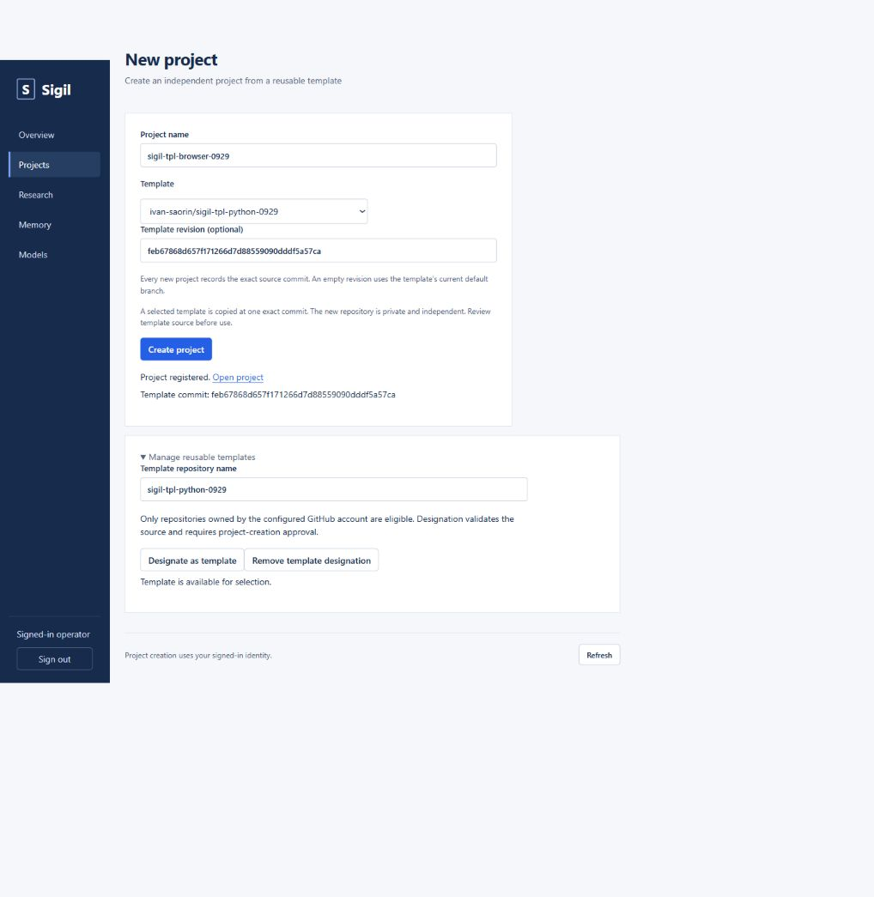

# Native project templates — live acceptance, 2026-09-29

**Required native creation workflow accepted on the intended running deployment.**
Implementation: `aef78f0d69cb7a21001bedd3dc728816fb618655`, followed by the
live-discovered revision-error correction
`c5cfe97c15d2ba5b287de87f27e28b492ab59d9e`. Operator reported rebuilding the
latter on automa; the running contract exactly matches that source's 2.6.1
document and the corrected behavior was verified live. Health is green but has
no build-SHA attestation endpoint. This final acceptance commit changes only
documentation and its screenshot; it does not require another service rebuild.

## Verified locally

Linux Docker test runtime, Rust 1.97.1, two Cargo build jobs and two test threads:

- `cargo fmt --all --check`: passed.
- `cargo clippy --workspace --all-targets -- -D warnings -A clippy::too_many_arguments`:
  passed; the allowance is the repository's established rule.
- `cargo test --workspace -- --test-threads=2`: 33 companion-library tests,
  10 companion-binary tests and 275 control-plane tests passed. Six existing
  control-plane tests and one provider integration test remain ignored by default.
- Actual dashboard assets in headless Edge/Playwright, synthetic loopback API:
  `browser-templates.cjs`, `browser-ui.cjs`, and all 11 `browser-races.cjs`
  regressions passed.

The new Git/provider tests use real source repositories and independent bare
destinations. They verify default creation and distinct Rust/Python template
contents/Dockerfiles, exact source SHA/tree provenance, branch movement between
resolution and fetch, repeat from SHA, independent edits, declared identity
adaptation, new approval namespace, durable restart, lost provider response,
concurrent exact retries, key reuse, incumbent preservation, interrupted staging,
persistence failure before remote creation, designation/revocation, authorization,
invalid manifests/refs, unknown fields, runtime bindings, LFS rejection and image
build failure without registration or opening a fallback workspace. The provider
defaults empty repositories to `main`; creation explicitly verifies `master` for
the normal SIGIL lifecycle.

Browser handler tests exercise the actual signed-in adapter, origin/CSRF checks,
shared authorization, designation and immutable provenance. Asset tests exercise
picker/ref/default payloads, uncertain retry, conflict recovery, navigation during
creation, displayed provenance and both eligibility-management actions.

Initial failing checks were resolved: an abandoned Git index lock poisoned retry;
completed concurrent retry returned 409; a fixture used the wrong browser route;
the runtime fixture did not emulate image inspection; and an existing skill
frontmatter test assumed LF despite Windows checkout CRLF. No production deadline,
supervision or authorization limits were weakened.

## Verified on the running deployment

Machine API: `https://api.016180.xyz/sigiled`.
Browser: `https://sigil.016180.xyz`, normal human-authenticated operator session.

| Check | Live evidence |
| --- | --- |
| Default creation | No template field selected vm-tmpl at `cf57bb5dc336c598d61845a19b46984eb210ebed`; workspace command, commit/push, close and reopen passed with files and provenance intact. |
| Eligibility and discovery | Controlled Rust/Python sources explicitly designated and discovered by driver. Browser removal hid Python from its picker; browser designation made it available again. Ordinary repositories were rejected. |
| Distinct environments | Rust source `a41ef2aa6d8197807d2cdade4f4367a06731b057` supplied Rust/Cargo 1.85.1 and compiled/ran its scene. Python source `feb67868d657f171266d7d88559090dddf5a57ca` supplied Python 3.13.5 and ran its distinct scene. |
| Contents and identity | SHA-256 checks matched source Dockerfile, engine, scene, asset, skill, identity declaration and synthetic receipt. Declared TOML identities adapted. Destinations had distinct provider IDs/project IDs/approval namespaces. Source approval data had a different ID and conferred no SIGIL authority. |
| Normal lifecycle | Both driver-created selected destinations and the browser-created destination completed open → useful compiler/interpreter command → independent edit → commit/push → close → reopen → verify/rerun → close. Writes closed with fast-forward and operational-log receipts. |
| Browser creation | Operator selected Python plus its full SHA; `sigil-tpl-browser-0929` registered, showed the exact SHA, and displayed source repository, SHA, new project ID and workspace Dockerfile in project overview. |
| Concurrency/retry | Simultaneous identical Python requests returned 201 and 200 with identical provenance/provider ID; exact completed retries returned 200; changed template selection returned 409. |
| Independence and repeat | Source stayed unchanged by destination edits. Rust source then advanced to `49cb12daa7600bcad328c90b8c0e97f72978597c`; original destination retained v1 and its own edit. A new project pinned to the earlier full SHA reproduced v1 with a new identity. Branch movement during resolution/fetch is separately covered by real-Git automated tests. |
| Real restart persistence | All six pre-browser fixture provenance/identity records survived the operator's actual service restart; exact retry still returned the original identity. |
| Rejections | Unauthenticated discovery/designation/creation returned 401. Ordinary source, missing ref and cross-owner selection returned 422. No invalid destination registered. After final designation removal, a new creation from the revoked source returned 422 and registered nothing. |
| Final state | Seven fixture repositories retained; zero open fixture sessions, zero fixture merge debt, both source designations removed through UI and absence confirmed by API. |



## Live correction and deployment configuration

Initial live GitHub missing-ref lookup returned 422 where the provider fixture
had returned 404; the old implementation reported a 502 destination conflict.
No destination was provisioned. The correction maps commit-lookup 404/409/422
to `template_revision_unavailable` (HTTP 422), advising an existing branch,
tag or full SHA. It keeps provider denial, rate limits and transient failures
separate. All 11 template/provider tests, formatting and Clippy passed; the older
missing-ref expectation was updated and two contract-filtered regressions passed.
The live 422 response was confirmed after the operator rebuilt c5cfe97.

The initial plain `restart.sh` invocation omitted the saved browser Compose
environment override, so the dashboard returned `browser_disabled`. Operator
diagnostics verified the override was unchanged and environment-only. The
project `.env` now selects the base file plus that override through COMPOSE_FILE,
retaining it for subsequent normal restarts; no old pinned image override was
selected. After rebuild, browser routes required normal sign-in and the full
designation/picker/create flow passed. No unrelated services were changed.

The operator completed browser sign-in after the previously selected account
was denied by Authentik. Driver device approval does not replace browser login;
no authentication policy was weakened. Browser automation used keyboard controls
after pointer actions failed to activate controls; the application UI and native
browser endpoints performed all designation and creation mutations.

## Retained test projects

All repositories are under `ivan-saorin`. None were deleted. All test sessions
are closed and have no merge debt. Source fixtures are no longer selectable.

| Project | Purpose / final state |
| --- | --- |
| `sigil-tpl-default-0929` | Default compatibility and persisted lifecycle marker. |
| `sigil-tpl-rust-0929` | Controlled Rust source, deliberately advanced to v2; designation removed. |
| `sigil-tpl-python-0929` | Controlled Python source; designation removed. |
| `sigil-tpl-film-a-0929` | Rust destination retains v1 and its independent edit. |
| `sigil-tpl-film-b-0929` | Python destination and concurrent-create identity check. |
| `sigil-tpl-repeat-0929` | Original Rust SHA reproduced after source advancement. |
| `sigil-tpl-browser-0929` | Browser-selected Python/full-SHA destination; full lifecycle passed. |

Names `sigil-tpl-invalid-0929` and `sigil-tpl-revoked-0929` were rejected and did
not register projects. No Opticon source, designation, approval or video changed.

## Supported use and remaining boundaries

UI: **New project → Manage reusable templates → Template repository name →
Designate as template**. Then enter a new project name, choose **Template**,
optionally enter **Template revision**, and choose **Create project**.
**Remove template designation** prevents future creation without changing projects.

Driver recipes (authenticated HTTPS under `/sigiled`, approval as documented):

```text
templates
template <repository-name> enable
new <new-project> from <repository-name> at <branch-tag-or-full-SHA>
```

These map to `GET /templates`, `PUT /templates/{name} {"enabled":true}` and
`POST /projects {"name":"...","template":"...","template_ref":"..."}`.
Omit template to retain vm-tmpl; omit ref to resolve the current default branch.
The immutable resolved revision appears in creation responses, project records,
browser overview and `.sigil/project.json`. Repeat that full SHA with a new
project name. Existing explicit foundation sync/drift behavior is unchanged;
application source provenance is separate from an optional vm-tmpl pin.

The browser **Open IDE** control currently reports that deployment setup is
needed. Browser template management and creation work; compiler/interpreter
workspace use and lifecycle were verified through the driver API. Full browser
IDE readiness is a separate deployment capability, not claimed by these tests.

Template sources must be prepared SIGIL workspace repositories under the
configured owner. Submodules, Git LFS and live application/job/service/secret
bindings are not supported. Opticon must validate its own approval receipt
portability and bind new approvals to destination identity and actual content;
SIGIL does not turn copied receipts into authorization. See
[project-templates.md](../project-templates.md) for the complete supported contract.

## Return to Opticon

Repository: `ivan-saorin/opticon`; last verified published revision supplied by
the user: `a84142534ace09f49523079dcd1110f80f57b8c6`. Reverify its current head
when resuming. M2 is complete and both films were accepted: “Both are good!”
Star export: 1920 × 1080; greeting accepted at exactly 2550 × 1440. Preserve
constrained reusable characters, shoulder-dependent elbow limits, multi-scene
sequencing, fades, cached audio and saved preview approval. Prior validation:
42 passing Windows/automa tests and nine CPU benchmark runs; do not repeat them
merely to resume. Evidence: `docs/test-results/ENGINE-M2.md`,
`docs/authoring-movies.md`, `engine/results/m2/approvals/`.

Once native creation passes live acceptance, finalize the production authoring
SKILL and deliberately prepare a clean reusable template. Validate a fresh SIGIL
project, receipt portability (existing receipts carry canonical local preview
paths), new project binding and content-specific authorization. Do not designate
the current research repo directly. The more demanding M3 film/scene is undecided;
agree its target with the user before starting it.
